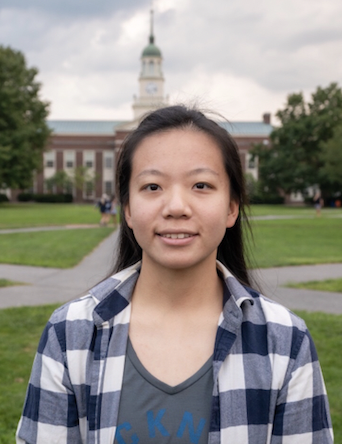

#### Cell: (570) 415-8058 
#### Email: jz3570@cumc.columbia.edu
#### Address: 50 Haven Ave, #243, New York, NY, 10032

#### Introduction: 
##### I am currently a first-year master's student in biostatistics major at Columbia University. I graduated with my Bachelor of Science degree in Applied Math with a concentration in statistics from Bucknell University.

##### I have always been quite skilled in extracting and analyzing data. I have taken several classes related to data analysis, such as Statistics I & II, Probability, Statistical Inference, Data Science and Biostatistical Method. At the same time, I can use Python, Minitab, and R language to analyze data more efficiently and effectively. I have done many projects related to biostatistics and data analysis. For my senior project, I investigated how substance use disorder is handled in recovery friendly businesses, where I design the randomized sampling process (stratified), calculate the sample size needed and the appropriate allocation in each stratum, created the survey questionnaire and wrote IRB proposal. 

## Education Experience
### Columbia University, Mailman School of Public Health	    
#### New York, NY, USA 
#### 09/2022-Present 
#### Master of Science in Biostatistics
#### 

### Bucknell University                                     	
#### Lewisburg, PA, USA 
#### 09/2018-05/2022 
#### Bachelor of Science in Applied Mathematics                GPA: 3.55/4.0
#### Dean's List, Art and Science College, 2020 spring semester

## Work Experience
### Bucknell Teaching and Learning Center
#### Level 2 Tutor and Study Group Facilitator	
#### 01/2020-05/2022
##### - Developed exercises to enhance content knowledge mastery and application.
##### - Created resources in the Statistics and Computer Science fields, such as problem-based worksheets and study plans.
##### - Mentored two new staff to develop their leadership and organizational skills further.

### The Effect of Oxytocin and Social Isolation
#### Research Assistant in Bucknell Biology Dept.	
#### 02/2021-present
##### - Explored the differentially expressed gene in voles’ brain tissues by DEBrowser and identified their function by gProfiler. 
##### - Trimmed off low quality genetic data by using fastqc and used Kallisto and Star for gene alignment
##### - Built regression models (negative binomial distribution) to explore the effect of treatments on specific genes.

### How substance use disorder is handled in recovery friendly businesses
#### Partnered with United Way    
#### 01/2022-05/2022
##### - Design the randomized sampling process (stratified). Calculate the sample size and the appropriate allocation in each stratum according to previous studies.
##### - Created the survey questionnaire and wrote IRB proposal.

